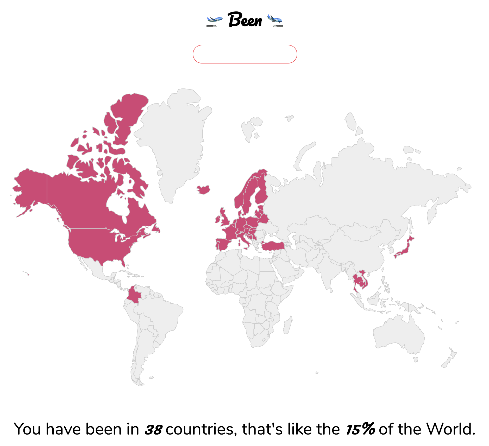

# 🛫 BEEN 🛬

> [https://https://been.netlify.com/](https://https://been.netlify.com/) - Keep track of where you have BEEN 🌍 🌎 🌏.

## Build

To install all the dependencies:

```bash
  yarn
```

To start the project locally:

```bash
  yarn start
```

To build it and deploy to gh-pages:

```bash
  yarn deploy
```

## Under the hood

- powered by [`create-react-app`](https://github.com/facebook/create-react-app)
- CSS in JS with [styled-components](https://www.styled-components.com/)
- database and auth thanks to [firebase](https://firebase.google.com/)
- sync of state / db using [re-base](https://github.com/tylermcginnis/re-base)
- check the syntax of the JS, according to [Prettier](https://prettier.io/) and [StandardJS](http://standardjs.com/) (via [ESLint](http://eslint.org/))

## See it in action


